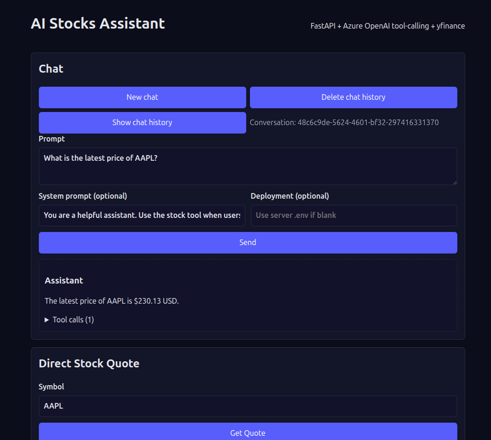

# Azure-OpenAI_StockTool


## 概要

Azure-OpenAI_StockToolは、FastAPIとAzure OpenAI（GPTモデル）を活用し、株価情報の取得・対話型AIアシスタント機能を提供するWebアプリケーションです。yfinance APIを用いて、リアルタイムの株価や企業情報、関連ニュースなどを取得できます。フロントエンドはReact (Vite) を採用しています。

---

## 主な機能

- **AIチャットアシスタント**  
  ユーザーの質問に対し、Azure OpenAIのモデルが株式ツールやAPIを呼び出して回答します。
- **株価の直接取得**  
  銘柄コードを入力することで、最新の株価情報を即座に取得し表示します。
- **企業情報・ニュース取得**  
  企業プロフィールや関連ニュースもAPIから取得可能です。

---

## 画面構成

- **チャットセクション**  
  - 質問プロンプト入力欄
  - システムプロンプト（任意）
  - Azure OpenAIのデプロイメント名指定（任意）
  - 回答＆ツールコールの結果表示

- **株価クイック取得セクション**  
  - 銘柄入力欄（例：AAPL）
  - 取得した株価・日時・通貨・データソース表示

---

## 技術スタック

- バックエンド: FastAPI
- AI: Azure OpenAI (GPT-4.1 nano 系), ツールコール実装
- データ取得: yfinance API
- フロントエンド: React (Vite)
- API認証: APIキーによる認証（.envで管理）

---

## セットアップ方法

1. **環境変数の設定**
   - `.env` ファイルにAzure OpenAI APIキーなど必要な設定を記載
   - 例: `AZURE_OPENAI_API_KEY`, `AZURE_OPENAI_DEPLOYMENT`, `APP_API_KEY` 等

2. **バックエンドの起動**
   ```bash
   uvicorn main:app --reload
   ```
   デフォルトで `http://127.0.0.1:8000` で起動します。

3. **フロントエンドの起動（開発時）**
   ```bash
   cd frontend
   npm install
   npm run dev
   ```
   デフォルトで `http://localhost:5173` でアクセス可能です。

4. **本番ビルド**
   ```
   npm run build
   ```
   `/app` でReactアプリが提供されます。

---

## API エンドポイント（抜粋）

- `/chat`  
  OpenAIベースの対話型チャットAPI。APIキー必須。
- `/quote/{symbol}`  
  株価クイック取得API
- `/news/{symbol}`  
  関連ニュース取得API
- `/profile/{symbol}`  
  企業プロフィール取得API

---

## 使用例

- チャット欄に「AAPLの最新株価は？」と質問
- 直接「AAPL」と入力し株価を取得

---

## 注意事項

- APIキーの漏洩に注意してください。
- yfinanceの仕様変更等による情報の遅延や取得失敗が発生する場合があります。
- Azure OpenAIの利用にはAzureサブスクリプション・権限が必要です。

---

## ライセンス

MIT License

---

## 開発・運用者向けメモ

- FastAPIは `127.0.0.1:8000` で起動
- ViteのReact開発サーバは `5173` ポート
- 本番運用時はReactをビルドし、`/app` 経由でアクセス

---

## お問い合わせ

バグ報告・機能要望などはGitHub Issuesをご利用ください。
